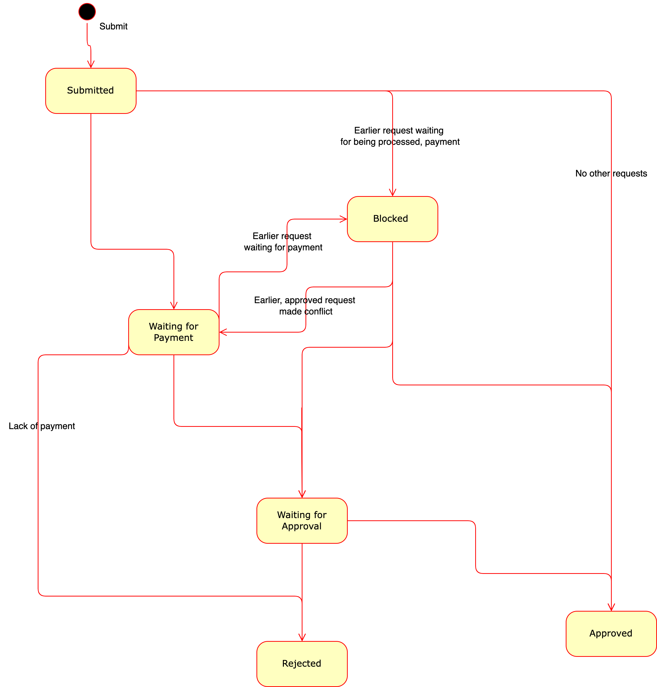

# landchain

Blockchain based land registry created for Hack4law hackaton 2022.

The repository consist of four parts.
1. Hyperledger Fabric blockchain network. Specifically, we store there scripts to control and interact with the network.
2. Smartcontracts.
3. Backend, service for executing business logic and communicating with the blockchain, it acts like an intermediary between client an blockchain.
4. Webapp, the client web interface.

## Request state diagram

